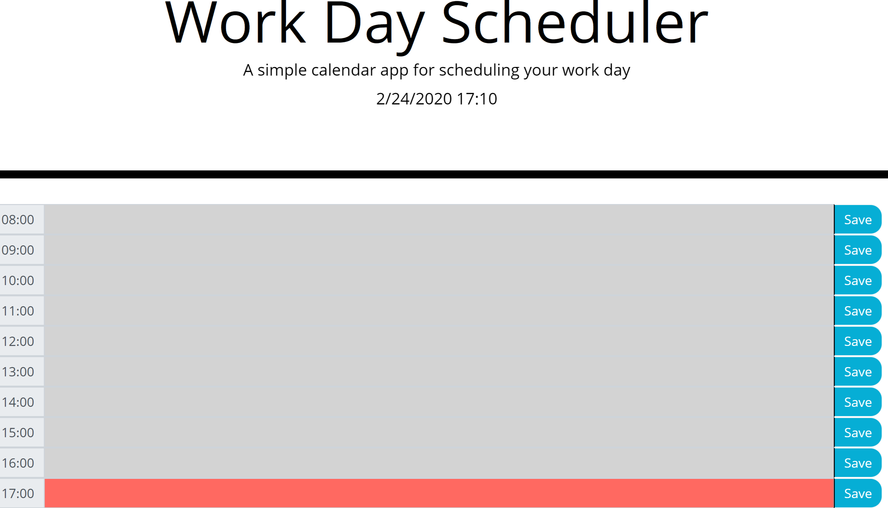
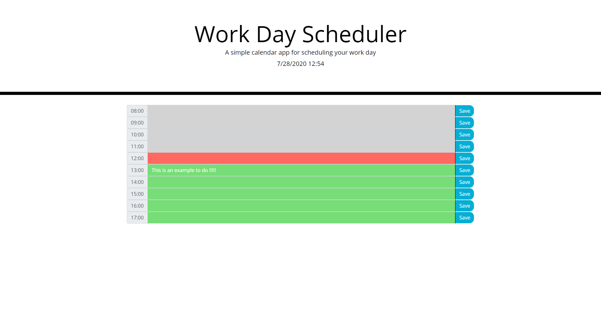

# day_planner

Day planner shows a "to do" list for the current day from 8:00 to 17:00. When you enter a "to do" it & hit the save button it will save that "to do". When the screen first comes up in will pull in all the "to do's" that were entered before & put them in their correct hour(Note: It will only hold one "to do" per hour. Also when the screen comes up past hours will be shaded gray, the current hour will be shaded red & future hours will be shaded green.

### Prerequisites

None.

### Installing

Installed using GitHub with following commands:

-   git add -A
-   git commit -m"comment goes here"
-   git push

## Running the tests

No automated testing

## Built With

-   HTML
-   Bootstrap
-   JavaScript

## Authors

-   **Jim Denis** - _Initial work_ - [JimDenis](https://github.com/JimDenis)

This app can be found on https://jimdenis.github.io/day_planner/
